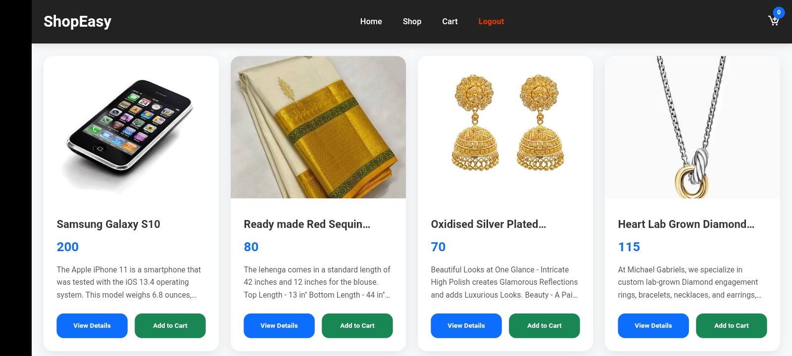
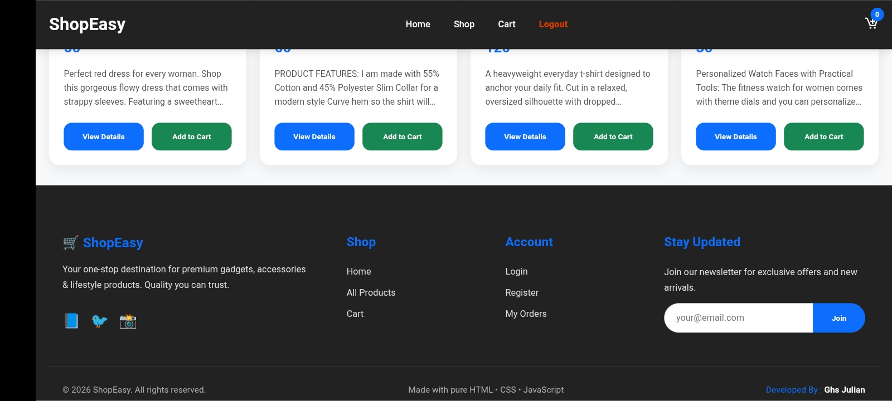
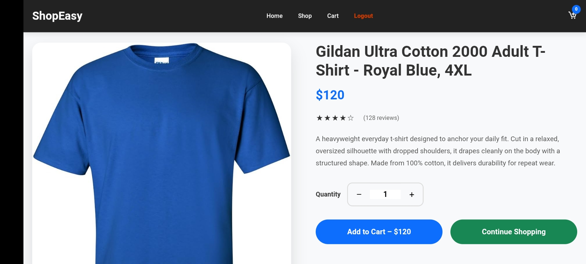
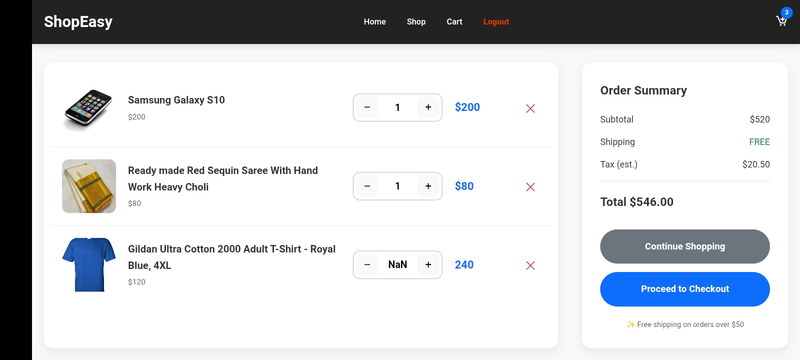
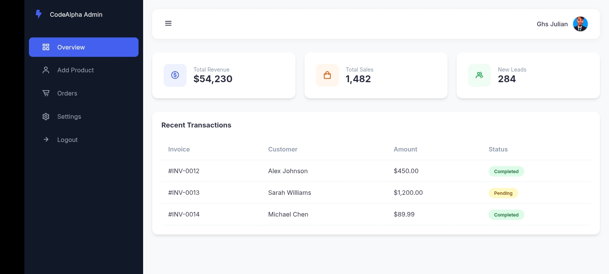
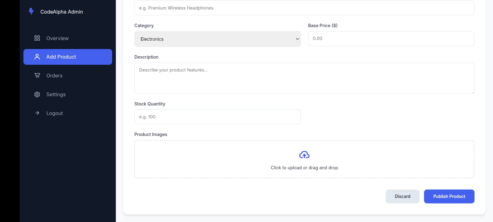
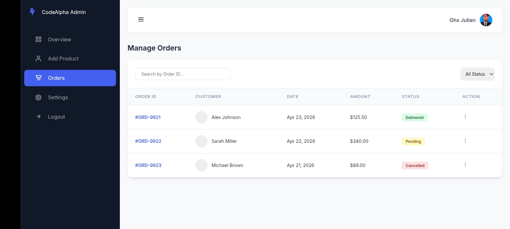

## CodeAlpha Easy Shop 🛒


---
---

### 📖 About Project
**CodeAlpha Easy Shop** **is a full-stack web application designed to provide a seamless and secure e-commerce experience. With dedicated authentication handling, optimized routing, and a responsive frontend interface, this platform is built to manage dynamic product inventories, streamline checkout processes, and securely handle user data.**

---
---

### Live Demo Link

##### Frontend Site   : <a href="https://codealpha-eshop.netlify.app" target="_blank">https://codealpha-eshop.netlify.app</a>
##### Admin Dashboard : <a href="https://codealpha-eshop.netlify.app/admin.html" target="_blank">https://codealpha-eshop.netlify.app/admin.html</a>
##### Backend API    : <a href="https://codealpha-easy-shop-api.onrender.com" target="_blank">https://codealpha-easy-shop-api.onrender.com</a>


---
---

### 🚀 Features

##### ⚡ Login and Registration
##### 🎯 Admin Panel And Dashboard
##### 🖥 Authentication with JSON Web Token(JWT)
##### 🌀 Products Listing
##### 📊 Rest API Integration (Nodejs,Express)
##### 📁 Password Hashing With Bcryptjs
##### 🧵 Used Cloudinary For Uploading Resources
##### ⚙ Optimized Responsive And Mobile UI
##### 📱 Cart And Order Processing
##### 💻 View Orders Functionalites
##### 🛍️ Create New Product On Admin Panel
##### 🔖 User Logout System

---
---

### ⚡ Core Technologies

```bash
+----------------------------+
| FRONTEND   |    BACKEND    |
|------------|---------------|
| HTML5      |    Nodejs     |
| CSS3       |    Expressjs  |
| JavaScript |    Mongodb    |
| Fontawesome|    Cloudinary |
| Responsive |    JWT        |
| UI         |    Hashing    |
+----------------------------+
```

---
---

### 🛠️ Languages
* **HTML5** (56.1%) - Structural framework for the web pages.
* **JavaScript (ES6+)** (24.3%) - Frontend interactivity and core Node.js backend logic.
* **CSS3** (19.6%) - Styling, layouts, and responsive design.
* **Mongodb** (50%) - For storing products, orders, and users information.

---
---

### 🧰 Tools & Technologies
* **Runtime Environment:** Node.js
* **Version Control:** Git & GitHub
* **API Testing:** Postman / Insomnia 
* **Environment Management:** Dotenv for secure `.env` configuration

---
---

### 📦 Modules & Libraries
Based on the repository's backend architecture, the primary stack utilizes the following essential Node.js libraries:
* **Express.js:** Fast, unopinionated web framework used for routing and handling HTTP requests.
* **Mongoose:** Elegant MongoDB object modeling for managing database schemas and relationships.
* **Bcrypt.js / JSONWebToken (JWT):** Utilized within `auth-controllers` for hashing passwords and issuing secure, stateless authentication tokens.
* **Dotenv:** Loads environment variables safely from the `.env` file to protect sensitive credentials.
* **CORS:** Middleware to enable and control Cross-Origin Resource Sharing.

---
---


### ✅ Main Site Screenshot 


<br/><br/>
<br/><br/>
<br/><br/>
<br/><br/>
<br/><br/>
<br/><br/>

---
---

### ✅ Admin Panel Screenshot 

<br/><br/>
<br/><br/>
<br/><br/>


---
---

### 📦 Requirements

Install dependencies in Termux:

```bash
npm install express
npm install dotenv
npm install mongoose
npm install morgan
npm install helmet
npm install jsonwebtoken
npm install cloudinary
npm install bcryptjs 
npm install cookie-parser
npm install cors
```

---
---

### 🛠 Installation

```bash
git clone [https://github.com/ghsjulian/codealpha-easy-shop.git](https://github.com/ghsjulian/codealpha-easy-shop.git)
cd codealpha-easy-shop
npm install && npm run dev
## Or you can run 
node index.js
```

---
---

### 🌐 Hosting Setup


--- 
---

### 👩‍💻 Programmer & Author

**Ghs Julian**  
##### Full Stack Developer
##### Web Development | Networking | Linux | Termux
##### Web :  https://ghsresume.netlify.app
##### Email : ghsjulian@outlook.com 
##### WhatsApp : +8801302661227

---
---

### ⭐ Support Me

**If you like this project :**

##### - Star the repository
##### - Fork the project
##### - Contribute improvements

---
---

### 📜 License

#### MIT License

***Free to use and modify.***

---
---

### Happy Coding 👩‍💻
### Radhe Radhe 🌺❤️🙏 

---
---